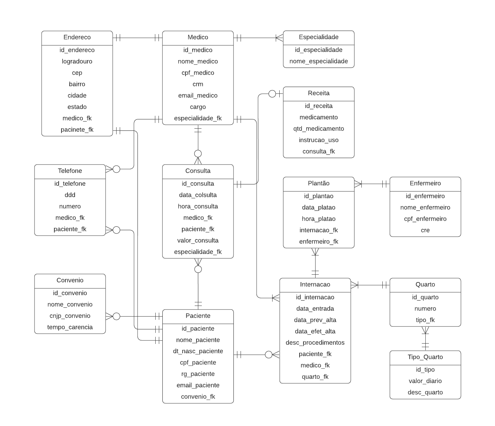

<h1 align='center'>Diagrama Entidade-Relacionamento de um Hospital</h1>

<h2>Analise a seguinte descrição e extraia dela os requisitos para o banco de dados:</h2>

<h3>🔹Parte 1</h3>

O hospital necessita de um sistema para sua área clínica que ajude a controlar consultas realizadas. Os médicos podem ser generalistas, especialistas ou residentes e têm seus dados pessoais cadastrados em planilhas digitais. Cada médico pode ter uma ou mais especialidades, que podem ser pediatria, clínica geral, gastroenterologia e dermatologia. Alguns registros antigos ainda estão em formulário de papel, mas será necessário incluir esses dados no novo sistema.

Os pacientes também precisam de cadastro, contendo dados pessoais (nome, data de nascimento, endereço, telefone e e-mail), documentos (CPF e RG) e convênio. Para cada convênio, são registrados nome, CNPJ e tempo de carência.

As consultas também têm sido registradas em planilhas, com data e hora de realização, médico responsável, paciente, valor da consulta ou nome do convênio, com o número da carteira. Também é necessário indicar na consulta qual a especialidade buscada pelo paciente.

Deseja-se ainda informatizar a receita do médico, de maneira que, no encerramento da consulta, ele possa registrar os medicamentos receitados, a quantidade e as instruções de uso. A partir disso, espera-se que o sistema imprima um relatório da receita ao paciente ou permita sua visualização via internet.

 

 
<h3>🔹Parte 2</h3>

No hospital, as internações têm sido registradas por meio de formulários eletrônicos que gravam os dados em arquivos. 

Para cada internação, são anotadas a data de entrada, a data prevista de alta e a data efetiva de alta, além da descrição textual dos procedimentos a serem realizados. 

As internações precisam ser vinculadas a quartos, com a numeração e o tipo. 

Cada tipo de quarto tem sua descrição e o seu valor diário (a princípio, o hospital trabalha com apartamentos, quartos duplos e enfermaria).

Também é necessário controlar quais profissionais de enfermaria estarão responsáveis por acompanhar o paciente durante sua internação. Para cada enfermeiro(a), é necessário nome, CPF e registro no conselho de enfermagem (CRE).

A internação, obviamente, é vinculada a um paciente – que pode se internar mais de uma vez no hospital – e a um único médico responsável.

 

 
<h3>🔹Parte 3 - Alimentando o banco de dados</h3>

 Crie scripts de povoamento das tabelas desenvolvidas na atividade anterior. Observe as seguintes atividades: 

<ul>
<li>Inclua ao menos dez médicos de </li>
<li>Ao menos sete especialidades (considere a afirmação de que “entre as especialidades há pediatria, clínica geral, gastroenterologia e dermatologia”).</li>
<li>Inclua ao menos 15 pacientes. </li>
<li>Registre 20 consultas de diferentes pacientes e diferentes médicos (alguns pacientes realizam mais que uma consulta). As consultas devem ter ocorrido entre 01/01/2015 e 01/01/2022. Ao menos dez consultas devem ter receituário com dois ou mais medicamentos. </li>
<li>Inclua ao menos quatro convênios médicos, associe ao menos cinco pacientes e cinco consultas. </li>
<li>Criar entidade de relacionamento entre médico e especialidade.  </li>
<li>Criar Entidade de Relacionamento entre internação e enfermeiro.  </li>
<li>Arrumar a chave estrangeira do relacionamento entre convênio e médico. </li>
<li>Criar entidade entre internação e enfermeiro. </li>
<li>Colocar chaves estrangeira dentro da internação (Chaves Médico e Paciente). </li>
<li>Registre ao menos sete internações. Pelo menos dois pacientes devem ter se internado mais de uma vez. Ao menos três quartos devem ser cadastrados. As internações devem ter ocorrido entre 01/01/2015 e 01/01/2022. </li>
<li>Considerando que “a princípio o hospital trabalha com apartamentos, quartos duplos e enfermaria”, inclua ao menos esses três tipos com valores diferentes. </li>
<li>Inclua dados de dez profissionais de enfermaria. Associe cada internação a ao menos dois enfermeiros. </li>
<li>Os dados de tipo de quarto, convênio e especialidade são essenciais para a operação do sistema e, portanto, devem ser povoados assim que o sistema for instalado. </li>
</ul>
